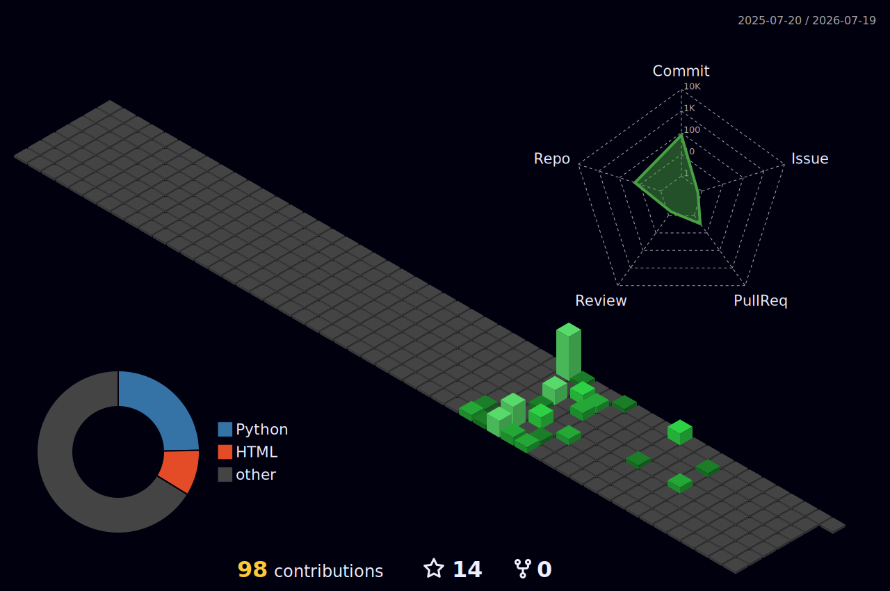

<div align="center">

<!-- HEADER -->


<!-- TYPING SVG -->
<a href="https://git.io/typing-svg"></a>

<br/>

<!-- SOCIAL BADGES -->
[](https://sayomiyori.github.io)

[](https://github.com/miyorisoft)
[](https://t.me/cons3qu3nc3s)
[](mailto:miyoricode@gmail.com)

</div>

---

## 🧑‍💻 About

```python
class SayomiYori:
    role      = "Python Backend Developer"
    location  = "Simferopol / Remote 🇷🇺"
    education = "Crimean Federal University (CS, 2028)"
    
    focus = [
        "Microservices (Django + FastAPI + RabbitMQ + Kafka + gRPC)",
        "Event-driven architecture & message brokers",
        "AI/LLM: RAG (pgvector), Agents, MCP, multi-provider",
        "CI/CD, Docker, Kubernetes, Observability",
        "WebSockets & real-time systems",
        "Strava / third-party OAuth 2.0 integrations",
    ]
    
    looking_for = "Backend position in a team with code review & engineering culture"
```

---

## ⚡ Tech Stack

<div align="center">

**`Core Backend`**


**`Data & Messaging`**


**`AI / LLM`**


**`Infrastructure & DevOps`**


**`Quality & Observability`**


</div>

---

## 🏗️ Featured Projects

<table>
<tr>
<td width="50%" valign="top">

### 🏃 [Runner Diary / NeuroTrainer](https://github.com/miyorisoft/RunnerDiary_Showcase)
**Commercial · Production · AI running coach, two platforms**

`FastAPI` `Qdrant` `Claude Haiku/Sonnet` `GPT-4o-mini` `Redis` `Strava API` `React 19` `TMA`

- 🔐 Two JWT auth flows: Telegram initData for TMA, Login Widget + Redis polling for web
- 🧠 RAG: GPT-4o-mini categorization → text-embedding-3-small → Qdrant → rerank → Claude
- 📚 16,778 chunks · 72 scientific docs · 14 categories · semantic cache in Redis
- 🏃 Strava OAuth 2.0 + webhook → background TrainingDraft → Telegram inline keyboard
- 🚀 Two platforms (TMA + web dashboard) on one async backend · VPS prod · closed beta

</td>
<td width="50%" valign="top">

### 🤖 [AgentHub](https://github.com/miyorisoft/AgentHub)
**AI platform — RAG + Agents + MCP + multi-provider LLM**

`FastAPI` `pgvector` `Celery` `Redis` `Gemini` `MCP` `Docker` `Prometheus`

- 🧠 RAG: chunk → embed (Gemini) → pgvector → rerank → cited answers
- 🛠️ AI agents: function calling (KB search, calculator, web, datetime)
- 🔌 MCP server (SSE) + external MCP client
- 🔀 Multi-provider: Gemini / Anthropic / OpenAI per-request
- 💰 Cost tracking: tokens + USD, usage stats API
- ⚡ Semantic cache (Redis, cosine ≥ 0.95), Prometheus + Grafana

</td>
</tr>

<tr>
<td width="50%" valign="top">

### 🔄 [EventPipe](https://github.com/miyorisoft/EventPipe)
**Microservice ETL pipeline — Kafka + gRPC + S3 + K8s**

`FastAPI` `gRPC` `Kafka` `PostgreSQL` `MinIO` `Kubernetes` `Prometheus` `Docker`

- 🏛️ 3 microservices: Ingest (REST + gRPC) → Transform → Query
- 📡 Kafka: topic partitions, consumer groups, Dead Letter Queue
- 📦 MinIO (S3): raw events as immutable JSON, pre-signed URLs
- 🔍 Query API: filters, pagination, aggregated stats
- ☸️ Kubernetes manifests, Minikube, horizontal scaling
- 📊 Prometheus + Grafana across all services

</td>
<td width="50%" valign="top">

### 🔀 [TaskFlow](https://github.com/miyorisoft/TaskFlow)
**Microservice task platform — Django + FastAPI + RabbitMQ**

`Django 5` `DRF` `FastAPI` `RabbitMQ` `Redis` `Channels` `Nginx` `Docker`

- 🏛️ 2 microservices: Django API + FastAPI notification consumer
- 📡 RabbitMQ topic exchange (task.created, task.updated)
- ⚡ WebSocket updates via Django Channels + Redis
- 🔒 JWT auth, role-based permissions, django-filter
- 🌐 Nginx reverse proxy with rate limiting

</td>
</tr>

<tr>
<td width="50%" valign="top">

### 🔗 [URLShort](https://github.com/miyorisoft/URLShort)
**High-performance URL shortener — ~180 RPS, 0% failures**

`FastAPI` `PostgreSQL` `Redis` `Nginx` `Locust` `Prometheus` `Grafana` `Docker`

- ⚡ ~180 RPS, p50=4ms, p95=14ms (Locust, 500 users)
- 🗄️ Redis: LRU cache, sliding window rate limiter, atomic counters
- 🌍 GeoIP analytics: country, city, device, referers
- 🌐 Nginx microcaching for 301 redirects
- 📊 Prometheus + Grafana dashboard

</td>
<td width="50%" valign="top">

### 🪝 [WebHook Manager](https://github.com/miyorisoft/WebHook_Manager)
**SaaS platform for reliable webhook delivery**

`FastAPI` `Celery` `Redis` `PostgreSQL` `Prometheus` `Sentry` `Docker`

- 🔄 Celery: exponential backoff (10s→1h), 5 retries
- 🔑 Idempotent intake + HMAC verification
- 🔌 Redis circuit breaker — no events lost
- 🏗️ Clean Architecture, >80% coverage

</td>
</tr>

<tr>
<td width="50%" valign="top">

### 💬 [RealTimeChat](https://github.com/miyorisoft/RealTimeChat)
**WebSocket chat with horizontal scaling**

`FastAPI` `WebSocket` `Redis Pub/Sub` `PostgreSQL` `JWT` `Docker`

- 📡 Redis Pub/Sub fan-out across N replicas
- 💬 Room-based messaging with history
- ⌨️ Typing indicators (real-time)
- 🔐 JWT auth, async stack (asyncpg + redis.asyncio)

</td>
<td width="50%" valign="top">

### 📚 [BookFinder API](https://github.com/miyorisoft/BookFinder-API)
**REST API for book search & cataloging**

`FastAPI` `PostgreSQL` `SQLAlchemy 2` `JWT` `Prometheus` `Grafana` `Docker`

- 📖 10 endpoints, Google Books integration
- 📊 Prometheus + Grafana: error rate, latency p95, RPS
- 🔄 CI/CD: ruff → pytest (87% cov) → Docker → auto-deploy

</td>
</tr>

<tr>
<td width="50%" valign="top">

</td>
</tr>
</table>

---

## 🧠 Architecture Decisions

> Why this stack? Every choice is intentional.

**Runner Diary / NeuroTrainer** — Qdrant over pgvector because retrieval and OLTP run on separate load profiles: vector ANN search with payload filters and collection versioning shouldn't compete with transactional writes on the same engine. Qdrant also gives hybrid search and quantization as first-class features without custom SQL.

Two Claude models instead of one — Haiku handles low-latency paths (training analysis, short clarifications) where full reasoning is unnecessary; Sonnet takes complex chat and plan generation where instruction-following depth matters. Keeping both reduces per-request cost at volume without sacrificing quality on heavy tasks.

GPT-4o-mini for categorization and embeddings, Claude for synthesis — right tool per pipeline stage, not vendor loyalty. Classification and `text-embedding-3-small` stay on OpenAI where the ecosystem fit is strong; response generation goes to Claude where citation discipline and context handling are better for this prompt style.

Redis semantic cache applied only to non-personalized queries — personalized context (user history, current training load) makes caching harmful, not just useless. MD5 key over the normalized question with 24h TTL: stale grounding is worse than a slow answer, so TTL is deliberately short relative to knowledge base update cadence.

Two auth flows on one backend — Telegram `initData` HMAC verification for TMA (stateless, no round-trip); Login Widget + Redis long-polling for web (disconnected callback bridged via short-TTL key without exposing secrets in URLs or hitting the database on every poll tick).

**AgentHub** — pgvector inside PostgreSQL instead of a dedicated vector DB — single data layer, transactional consistency, simpler backups. Semantic cache in Redis with LSH bucketing: near-identical questions return cached answers without burning tokens. MCP server for interoperability — external agents can use AgentHub's knowledge base as a tool.

**EventPipe** — Kafka over RabbitMQ because the pipeline processes high-throughput event streams where ordering and replay matter. Separate Ingest/Transform/Query services with different scaling profiles. Dead Letter Queue as a separate topic — failed events don't block the main pipeline.

**TaskFlow** — Django for ORM-heavy domain logic + FastAPI for the async notification consumer. RabbitMQ topic exchange decouples write-side transactions from delivery.

**URLShort** — Redis sliding window (ZSET) for rate limiting — exact per-second precision. Atomic counters + periodic flush reduce PG write load by ~100x. Nginx microcaching for 301 redirects — hot URLs served without hitting FastAPI.

**WebHook Manager** — Celery for fire-and-forget delivery. Circuit breaker prevents hammering dead endpoints. HMAC + idempotency at infrastructure layer, not business logic.

**RealTimeChat** — Redis Pub/Sub over in-memory broadcast — scaling to N replicas is transparent. WS auth via query param because browsers don't support custom headers on handshake.

---

## 📊 GitHub Stats

<div align="center">


<br/>


</div>

---

## 🧊 3D Contribution Calendar

<div align="center">



</div>

---

<div align="center">


<br/><br/>


</div>

---

## 🐍 Contribution Snake

<div align="center">

<picture>
  <source media="(prefers-color-scheme: dark)" srcset="https://raw.githubusercontent.com/miyorisoft/miyorisoft/output/github-snake-dark.svg" />
  <source media="(prefers-color-scheme: light)" srcset="https://raw.githubusercontent.com/miyorisoft/miyorisoft/output/github-snake.svg" />
  
</picture>

</div>

---

<div align="center">

**Open to opportunities · Python Backend Developer · Remote**

</div>


